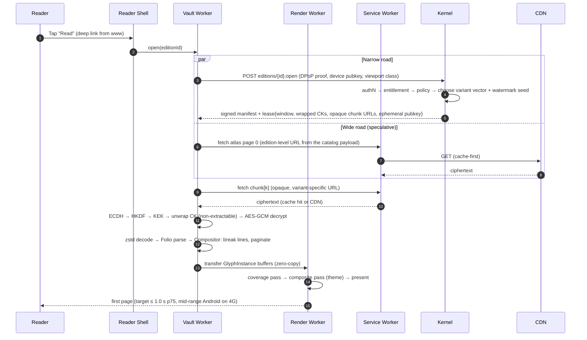

# 01 — Core Architecture: The Cohesive Dough

> One principle organizes the whole system:
> **content travels the wide road, keys travel the narrow road.**
> Ciphertext is bulky, identical for every reader of a variant, and lives on a
> CDN. Keys are tiny, personal and short-lived, and come only from the Kernel.
> Security and performance stop competing because they no longer share a path.

---

## 1. High-level architecture

```text
                        ┌────────────────────────────────┐
                        │         READER  (human)        │
                        └───────────────┬────────────────┘
  gestures · keys · screen reader       │  ▲ pixels only — never text
                                        ▼  │
╔═════════════════════════════════════════════════════════════════════════════╗
║ L1 · FRONTEND                                                               ║
║ ┌────────────────────────────────┐   ┌────────────────────────────────────┐ ║
║ │ www.sanad.app · Next.js (SSR)  │   │ read.sanad.app · Vite SPA          │ ║
║ │  catalog · SEO book pages      │──▶│  clean-room origin: strict CSP,    │ ║
║ │  library · account · checkout  │   │  COOP/COEP, zero third-party JS    │ ║
║ └────────────────────────────────┘   │                                    │ ║
║                                      │  Reader Shell (React + React Aria) │ ║
║                                      │     │ input ring (SharedArrayBuf.) │ ║
║                                      │     ▼                              │ ║
║                                      │  Render Worker ◀── Vault Worker    │ ║
║                                      │  Lumen · WebGL2    CryptoKeys      │ ║
║                                      │  OffscreenCanvas   Folio decoder   │ ║
║                                      │                    Compositor WASM │ ║
║                                      │  Service Worker ── ciphertext cache│ ║
║                                      └────────────────────────────────────┘ ║
╚═══════════════════╤═════════════════════════════════════════╤═══════════════╝
   (A) WIDE ROAD    │ ciphertext chunks       (B) NARROW ROAD │ leases · keys
   immutable, CDN-  │ bulk · same bytes       per user/device │ policy
   cacheable        ▼ for every reader        tiny · signed   ▼ telemetry
╔═══════════════════════════════════╗   ╔═════════════════════════════════════╗
║ L2 · EDGE                         ║   ║ L3 · UNIFIED SECURITY KERNEL (Rust) ║
║ CDN — signed, variant-opaque URLs ║   ║ Identity     passkeys · DPoP · dev. ║
║ WAF — rate shaping                ║   ║ Entitlement  who may read what      ║
║ Human attestation (invisible)     ║   ║ Policy       profiles · quotas      ║
╚═════════════════╤═════════════════╝   ║ Lease & Key  windows · key wrapping ║
                  │ origin pull         ║ Ex Libris    watermark assignment   ║
                  │                     ║ Sentinel     velocity · anomalies   ║
                  │                     ║ License GW   Widevine·PlayReady·FPS ║
                  │                     ╚════╤═══════════╤═════════════╤══════╝
                  │                          │           │             │
                  │                     ┌────▼────┐ ┌────▼─────┐ ┌─────▼──────┐
                  │                     │ KMS/HSM │ │ Postgres │ │ Oracle     │
                  │                     │ root of │ │ Valkey   │ │ search     │
                  │                     │ trust   │ │          │ │ (Tantivy)  │
                  │                     └─────────┘ └──────────┘ └────────────┘
                  ▼
╔═════════════════════════════════════════════════════════════════════════════╗
║ L4 · ENCRYPTED STORAGE (S3-compatible object store — ciphertext only)       ║
║ Folio chunks (AES-256-GCM, A/B variants) · shredded glyph atlases ·         ║
║ image tile pyramids · Oracle index segments · Vault CMAF (CENC 'cbcs')      ║
╚══════════════════════════════════════▲══════════════════════════════════════╝
                                       │ writes ciphertext only
                        ┌──────────────┴─────────────────┐
                        │ ATELIER · ingest & typesetting │
                        │ EPUB / PDF → shape → Folio     │
                        │ ◀── Publisher Portal uploads   │
                        └────────────────────────────────┘
```

*Not drawn:* the **Product API** (TypeScript) handles catalog, library,
annotations, progress history, profiles and, in Phase 2, commerce. It sits
beside the Kernel behind the same edge and **never touches keys or content**.
That separation is deliberate. Product features can ship daily without anyone
re-reviewing the security core.

### 1.1 Layer responsibilities

| Layer | Owns | Never holds |
|---|---|---|
| **L1 Frontend** | Presentation, gestures, layout (Compositor), GPU rendering, ciphertext cache | Unicode text of protected content, unwrapped key bytes, font files |
| **L2 Edge** | Delivery of ciphertext, TLS, DDoS/WAF, invisible human attestation | Keys, entitlements |
| **L3 Kernel** | Identity, entitlement, policy, key derivation and wrapping, watermark assignment, telemetry | Ciphertext at rest (it does not proxy content) |
| **L4 Storage** | Immutable ciphertext objects | Keys (TMKs live in Postgres wrapped by KMS, never next to the content) |
| **Atelier** | Converting source files into encrypted Folio editions | Long-term plaintext. Source files are destroyed or vaulted after ingest, per publisher contract. |

---

## 2. Request lifecycle: opening a book



### 2.1 Steady state: the sliding window

```text
 chapter:      ┌───── 3 ─────┐┌─────── 4 ────────┐┌───── 5 ─────┐
 chunks:       [c18][c19][c20][c21][c22][c23][c24][c25][c26][c27]
 lease window:           [c20][c21][c22][c23][c24][c25]
                         ◀─ back ─▶  ▲  ◀─── ahead ───▶
 reader position:                    └─ anchor (c22 · block 7 · cluster 112)

 renewal trigger:  TTL at 50 %  OR  position crosses the window midpoint
 renewal payload:  position anchor (→ cross-device sync) + telemetry digest
 renewal response: keys for the new window; keys that slid out are not renewed
```

- **Window size is personal.** `ahead` covers about 30 minutes at *this reader's*
  measured pace (minimum 3 chunks). `back` covers 2 chunks. A fast reader gets
  a wider window and never waits. A scraper sweeping at 50 pages a second
  outruns its window and meets the velocity model
  ([05 §5](05-security-and-drm.md#5-anti-automation-the-sentinel-velocity-model)).
- **Jumps are first-class.** Opening the table of contents, a search hit, a
  bookmark or an annotation triggers `leases:jump` with a declared *navigation
  intent*. Jumps are generous, so a human never notices them, and they are
  rate-shaped, so a sweep across the whole book is expensive.
- **Expiry is invisible.** The lease TTL is 15 minutes, and renewal happens
  at 50%. A reader who closes the laptop for an hour reopens to an instant
  silent renewal. Pages already laid out stay on screen meanwhile.

### 2.2 Offline

When a reader taps "Download for offline", the Kernel issues an **offline
lease**. It contains all chunk keys of the reader's variant vector, wrapped to
the device's non-extractable ECDH key, with a 30-day expiry. Policy can
shorten that for premium titles. Ciphertext goes into the Service Worker
cache. Renewal is silent whenever the device is online, and a per-account cap
on offline devices applies. Two caveats:

- iOS Safari may evict storage of sites that are not installed after 7 days
  without use. Offline mode therefore nudges the reader to *Add to Home
  Screen*. Installed PWAs are exempt. We also call
  `navigator.storage.persist()`.
- Copying the cache directory to another device gives nothing. The wrapped keys
  only open with a private key that cannot be exported off the original device (P2).

---

## 3. The Unified Security Kernel

The Kernel is **one Rust service with one policy brain**. Authentication, DRM
tokens and content keys come out of the same process, the same audit log and
the same decision. That makes protection feel native: every security decision
is made once, in one place, and it arrives at the reader as a capability, not a
challenge.

### 3.1 Modules

| Module | Responsibility | Key technology |
|---|---|---|
| **Identity** | Passkeys (WebAuthn) first, email magic link as fallback, OAuth (Apple/Google). Device registration. Anonymous sessions for sampling free books. | `webauthn-rs`, DPoP (RFC 9449) |
| **Entitlement** | Who may read which edition, for how long, at which profile. Kinds: `free`, `sample`, `purchase`, `subscription`, `rental`, `library_loan`. | Postgres, Cedar policies |
| **Policy** | Evaluates *(principal, edition, device, context)* → profile, window size, quotas, offline rights, Vault robustness. | **Cedar** (open-source, Rust-native policy language) |
| **Lease & Key** | Derives chunk/atlas/tile keys from the TMK and wraps them to the device. Issues and renews leases. | KMS, HKDF, AES-KW, ECDH P-256 |
| **Ex Libris** | Assigns each session a collusion-resistant watermark codeword, which maps to the A/B variant vector plus a micro-typography seed | Tardos codes, see [05 §4](05-security-and-drm.md#4-ex-libris--forensic-watermarking) |
| **Sentinel** | Ingests telemetry digests and scores velocity and automation signals. Shapes leases rather than blocking readers. | Streaming aggregates in Valkey, rules plus a gradient-boosted model |
| **License Gateway** | *(Phase 2)* Upfront-token or callback authority for the multi-DRM license service (Widevine, PlayReady, FairPlay) | Multi-DRM provider integration |

### 3.2 Identity and device binding

```text
 Device bootstrap (first launch on read.sanad.app)
 ─────────────────────────────────────────────────
 WebCrypto generates, non-extractable, persisted as CryptoKey objects in IndexedDB:
   • DeviceKey-ECDH   (P-256)  → receives wrapped content keys
   • DeviceKey-Sign   (P-256)  → signs DPoP proofs on every Kernel request
 Public halves → POST /kernel/v1/devices  (bound to the passkey-authenticated user)

 Every request:
   Authorization: DPoP <access_token>        (token.cnf.jkt = thumbprint(DeviceKey-Sign))
   DPoP: <proof JWT signed by DeviceKey-Sign over method, URL, iat, nonce>
```

- **Stolen tokens are worthless.** An access token without the device's signing
  key fails the DPoP check. The private keys cannot be exported, so an
  attacker would have to operate *from the victim's device*, which is exactly
  where Sentinel watches.
- **Passkeys remove the password database** and with it credential stuffing,
  phishing and account sharing by password. Sign-in is one biometric tap,
  which is better UX and stronger security at once.
- **Device caps are humane.** Up to 6 active devices and 2 concurrent reading
  sessions per edition. When a reader hits the cap, the prompt is *"You're
  reading on your iPad — continue here?"*, never an error.
- **Anonymous sampling.** Free books can be read for the first chapters with
  no account, under an anonymous device identity with tighter policy (smaller
  window, no offline). Signing up later carries progress over. This is the
  Phase 1 acquisition funnel.

### 3.3 Key hierarchy

```text
 KMS / HSM root key  (never leaves the HSM)
   │  wraps (envelope encryption)
   ▼
 TMK  Title Master Key — 256-bit random, one per edition version
   │  stored only as a KMS-wrapped blob in Postgres
   │
   ├─ HKDF(TMK, salt = edition_id ‖ variant, info = "folio/chunk/v1" ‖ idx)
   │     └─▶ CK[idx, variant]   chunk content keys       (AES-256-GCM)
   │
   ├─ HKDF(TMK, salt = edition_id, info = "folio/atlas/v1" ‖ font ‖ page)
   │     └─▶ AK[font, page]     glyph-atlas page keys     (AES-256-GCM)
   │
   ├─ HKDF(TMK, salt = edition_id, info = "folio/tile/v1" ‖ image_id)
   │     └─▶ IK[image]          image-tile-pyramid keys   (AES-256-GCM)
   │
   └─ HKDF(TMK, salt = edition_id, info = "folio/cenc/v1" ‖ kid)
         └─▶ CENC content key   Vault-mode video keys     (Phase 2)

 Per lease (ephemeral):
   EK  = fresh ECDH P-256 key pair generated by the Kernel
   Z   = ECDH(EK.private, DeviceKey-ECDH.public)
   KEK = HKDF-SHA256(Z, salt = lease_id, info = "sanad/lease/v1")
   wrapped[i] = AES-KW(KEK, CK[i])     ── only wrapped keys leave the Kernel
```

**Client-side unwrap (Vault Worker):**

```ts
// All keys non-extractable. Raw key bytes never become JS-visible after unwrap.
const z = await crypto.subtle.deriveBits(
  { name: "ECDH", public: leaseEphemeralPub }, deviceEcdhPriv, 256);
const hk = await crypto.subtle.importKey("raw", z, "HKDF", false, ["deriveKey"]);
const kek = await crypto.subtle.deriveKey(
  { name: "HKDF", hash: "SHA-256", salt: leaseIdBytes, info: LEASE_INFO },
  hk, { name: "AES-KW", length: 256 }, false, ["unwrapKey"]);
const ck = await crypto.subtle.unwrapKey(
  "raw", wrappedCk, kek, "AES-KW", { name: "AES-GCM" }, false, ["decrypt"]);
new Uint8Array(z).fill(0); // hygiene, not a boundary
```

> **Honest note.** A non-extractable `CryptoKey` cannot be exported, but code
> running in the page can still *use* it. That is acceptable. The decrypted
> payload is a stream of permuted, shredded glyph IDs with no Unicode, so
> using the key gets an attacker to T2, not to the text (see
> [00 §3](00-vision-and-principles.md#3-threat-model)).

**Bounded blast radius (P5).** A leaked CK opens one chunk (about 2–6 pages) of
one variant. A leaked lease KEK opens one window for one device. Only a TMK
leak exposes an edition, and TMKs exist in plaintext only inside the Kernel's
memory for minutes, behind KMS `Decrypt` calls that are audited and rate-limited.

### 3.4 The Reading Capability Token (RCT)

Each lease carries a compact, signed capability. Oracle, the accessibility
endpoint and the quote endpoint verify it **without a database round trip**.

```jsonc
// PASETO v4.public (Ed25519), Kernel-signed, TTL = lease TTL (15 min)
{
  "sub": "usr_7Hc…",            // user
  "dev": "jkt:9fQ…",            // DPoP key thumbprint — must match the request
  "ed":  "edn_2Lw…@v3",         // edition + version
  "win": [20, 25],              // chunk window this lease covers
  "pro": "standard",            // protection profile
  "q":   { "quote_left": 412 }, // remaining quote budget, in clusters
  "a11y": true,                 // accessibility channel enabled for this reader
  "sid": "ses_Qm…",             // reading session → watermark codeword
  "exp": "2026-10-01T14:15:00Z"
}
```

### 3.5 Policy as code

Policies are Cedar documents, versioned in the repo and evaluated in
microseconds. Publishers configure them through presets in the publisher
portal and never write Cedar themselves.

```cedar
// Vault-profile titles require hardware-backed decryption ...
@id("vault-requires-hw")
permit (principal, action == Action::"open", resource)
when {
  resource.profile == "vault" &&
  ["HW_SECURE_ALL", "SL3000", "FPS_HW"].contains(context.device.robustness)
};

// ... unless the publisher allows a Standard fallback. The Kernel reads the
// @downgrade annotation on the determining policy and serves the Standard profile.
@id("vault-standard-fallback")
@downgrade("standard")
permit (principal, action == Action::"open", resource)
when {
  resource.profile == "vault" &&
  resource.publisher.allowStandardFallback
};
```

Robustness labels are normalized by the Kernel from the EME capability probe
(see [05 §2.3](05-security-and-drm.md#23-capability-negotiation)).

### 3.6 Kernel API surface

The browser talks to the Kernel with Connect-protocol unary calls: plain
HTTP POST with protobuf or JSON bodies. Schemas are Protobuf, generated for
Rust and TypeScript with `buf`.

| Endpoint | Purpose | Auth |
|---|---|---|
| `POST /kernel/v1/auth/passkey:{begin,finish}` | WebAuthn ceremonies: sign up or sign in *this device* | DPoP |
| `POST /kernel/v1/devices` | Register device public keys (anonymous until a passkey signs in) | DPoP proof |
| `POST /kernel/v1/editions/{id}:open` | Manifest + first lease | DPoP |
| `POST /kernel/v1/leases/{id}:renew` | Slide window, sync position, telemetry digest | DPoP |
| `POST /kernel/v1/leases:jump` | Navigation-intent jump (TOC, search, bookmark, note) | DPoP + RCT |
| `POST /kernel/v1/offline/{edition}:{checkout,return}` | Offline lease | DPoP |
| `POST /oracle/v1/search` | Protected search ([03 §6](03-reader-engine.md#6-protected-search)) | DPoP + RCT |
| `POST /kernel/v1/quote` | Quote card or metered copy ([03 §8](03-reader-engine.md#8-selection-annotations-quoting--accessibility)) | DPoP + RCT |
| `POST /kernel/v1/a11y/text` | Accessible text for the visible range | DPoP + RCT |
| `POST /kernel/v1/drm/license` | *(Phase 2)* EME license proxy | DPoP + RCT |
| `POST /kernel/v1/telemetry` | Batched reading-behavior digests | DPoP |

### 3.7 Operational shape

- **Stateless replicas.** Lease state lives in Valkey with a TTL. Durable state
  lives in Postgres. Kernel pods scale horizontally behind the edge.
- **Load is small.** A reader reads about one page a minute, so a 40-minute
  session renews about 6 leases. 100k DAU averages under 10 req/s with peaks
  around 100. The narrow road stays narrow.
- **KMS economics.** TMKs are unwrapped once and cached in memory with a short
  TTL and a hard cap on entries. That keeps KMS calls proportional to *active
  editions*, not readers.
- **Audit.** Every TMK unwrap, offline checkout, quota grant and policy override
  is written to an append-only audit log. Key export requires two people.

---

## 4. Folio — the encrypted content container

### 4.1 Edition layout in object storage

```text
e/{H(edition_id)}/v{n}/
  manifest.sig                      # signed manifest (Ed25519), public, no secrets
  c/{HMAC(K_name, idx ‖ variant)}   # chunk ciphertext; names are opaque, so a
                                    # client cannot guess its sibling variant
  a/{font}/{page}.atl               # encrypted, shredded MSDF atlas pages
  t/{image_id}/{z}/{x}_{y}.tile     # encrypted image tile pyramid
  x/{segment}.idx                   # Oracle index segments (server-side only, never on CDN)
  v/…                               # Vault CMAF renditions (Phase 2)
```

### 4.2 Manifest

The manifest is **public by design**, so it may be cached anywhere. It
contains structure, never content:

```jsonc
{
  "edition": "edn_2Lw…", "version": 3, "format": "reflow",   // or "fixed"
  "lang": "ar", "dir": "rtl", "progression": "rtl",
  "chunks": 412, "variants": 2,
  "toc": [ { "label_glyphs": "…", "anchor": [0, 0, 0] } ],  // labels are glyph runs too
  "fonts": [ { "id": "f0", "role": "body", "atlas_pages": 3, "upem": 1000,
               "metrics": { "ascender": 0.92, "descender": -0.28, "x_height": 0.47 } } ],
  "styles": "…style table: size, weight, spacing, color roles …",
  "images": [ { "id": "img_9", "w": 2400, "h": 1600, "class": "lineart" } ],
  "reading_time_model": { "clusters": 1834220 },
  "profiles": ["standard"],                                 // + "vault" when packaged
  "signature": "ed25519:…"
}
```

### 4.3 Chunk binary layout

```text
offset  size  field
──────  ────  ─────────────────────────────────────────────────────────
0       4     magic  "FOLI"
4       1     format version (1)
5       1     kind   (0 = flow chunk, 1 = page chunk, 2 = atlas page, 3 = tile)
6       2     flags  (bit0: zstd, bit1: has-variant, bit2: last-in-chapter)
8       16    edition_id (UUID)
24      4     chunk index
28      1     variant index (0–3; Phase 1 uses 0 = A, 1 = B)
29      3     reserved
32      12    AES-GCM nonce (random per object)
44      4     plaintext length
48      n     ciphertext  =  AES-256-GCM(CK, nonce, zstd(FlatBuffer payload), AAD)
48+n    16    GCM tag
AAD = bytes[0..32]  — the header is authenticated, so chunks cannot be
      swapped between editions, indices or variants
```

Compress, then encrypt. A compression oracle is not possible here: there is
no attacker-controlled input mixed with the secret payload.

### 4.4 Payload schemas (FlatBuffers)

FlatBuffers allow **zero-copy reads inside WASM memory**. Nothing is parsed
into JS objects, so no protected structure is ever mirrored in the JS heap.

```fbs
// Reflowable content: shaped, but NOT line-broken (see D1)
table FlowChunk {
  blocks: [Block];
}
table Block {
  kind: BlockKind;            // Paragraph, Heading, Quote, ListItem, Figure, Table, Rule, Break
  level: ubyte;               // heading level / list depth
  style: ushort;              // index into manifest style table
  dir: Dir;                   // LTR | RTL (paragraph base direction)
  runs: [Run];
  figure: ImageRef;           // for Figure blocks
}
table Run {
  font: ubyte;  style: ushort;
  gids:     [ushort];         // PERMUTED glyph ids (per-edition permutation)
  advances: [short];          // font units (variant B carries micro-perturbations)
  offsets:  [short];          // x,y pairs for marks and kerning, font units
  flags:    [ubyte];          // per glyph, see below
  bidi:     [ubyte];          // UAX #9 embedding level per glyph
}
// flags bits:
//  0 CLUSTER_START   1 BREAK_OK      2 GLUE (stretch/shrink)   3 HYPHEN_POINT
//  4 KASHIDA_OK      5 WORD_START    6 SENTENCE_START          7 NO_JUSTIFY

// Fixed-layout content (PDF origin): absolute positions per page
table PageChunk {
  pages: [Page];
}
table Page {
  width: float; height: float;      // points
  glyphs: [GlyphInstance];          // struct: gid, x, y, size, color, font
  vectors: [TileRef];               // rasterized vector art, tile pyramid
  images: [ImagePlacement];
  blocks: [BlockRect];              // column and paragraph rects → double-tap zoom, selection
}
```

### 4.5 Chunking strategy

- **Reflow:** cut at paragraph boundaries into 16–48 KB compressed chunks,
  about 2–6 pages at default size. Never cut inside a paragraph, because the
  Compositor must see whole paragraphs to run Knuth–Plass.
- **Fixed:** 1–4 pages per chunk, depending on density.
- **Variants:** each chunk exists in 2 variants (A/B) in Phase 1, extended
  to 2–4 in Phase 2 for q-ary fingerprinting codes. Variants differ in
  micro-typography only (see [05 §4](05-security-and-drm.md#4-ex-libris--forensic-watermarking)).
  Storage cost is ×2–×4 on text, which is negligible next to images. Images
  carry their own marks instead (Phase 2).

---

## 5. Atelier — the ingestion & typesetting pipeline

```text
  upload ─▶ ① Intake ─▶ ② Normalize ─▶ ③ Style ─▶ ④ Shape ─▶ ⑤ Obfuscate ─▶ ⑥ Atlas
                                                                              │
  publish ◀─ ⑪ QA ◀─ ⑩ Index ◀─ ⑨ Encrypt ◀─ ⑧ Compress ◀─ ⑦ Variants ◀───────┘
```

| Stage | What happens | Tools |
|---|---|---|
| ① **Intake** | Validate the EPUB (EPUBCheck) or PDF. Scan for malware. Extract metadata. Hash the source. | EPUBCheck, ClamAV |
| ② **Normalize** | XHTML → semantic block tree. PDF → per-page display lists with text runs, vectors and images. | `html5ever`, MuPDF / PDFium |
| ③ **Style** | Resolve a *safe CSS subset* into a compact style table. Publisher styles are kept as "Original" and can be toggled by the reader. | Custom cascade |
| ④ **Shape** | Bidi (UAX #9) → HarfBuzz shaping → hyphenation points (Liang patterns) → kashida opportunities for Arabic → per-glyph flags. Runs once per reading font, so a font switch is one cached fetch. | `rustybuzz` / HarfBuzz, `unicode-bidi`, `hyphenation` |
| ⑤ **Obfuscate** | Per-edition **glyph permutation** and **glyph shredding**: each glyph is split into 2–3 outline fragments stored in unrelated atlas slots | Custom, see [03 §4](03-reader-engine.md#4-anti-tamper-rendering-pipeline) |
| ⑥ **Atlas** | Render fragments to MSDF atlas pages, ordered by frequency so page 0 covers about 95% of the text. Lossless only. | `msdfgen` |
| ⑦ **Variants** | Generate A/B micro-typographic variants per chunk | Ex Libris encoder |
| ⑧ **Compress** | zstd level 19 (decoded in WASM on the client) | `zstd` |
| ⑨ **Encrypt** | Derive CK per chunk and variant, AES-256-GCM with header AAD, write opaque object names | `aws-lc-rs` |
| ⑩ **Index** | Build Oracle index segments from the *server-side* text: normalized, Arabic root and stem aware | Tantivy |
| ⑪ **QA & publish** | Visual regression (render sample pages headless, diff against reference), accessibility text check, then atomic manifest swap | Lumen in headless Chromium |

**Anchor migration.** When a publisher uploads a corrected edition (v3 → v4),
Atelier diffs content-addressed block hashes and emits an **anchor remap
table**. Highlights, notes and reading positions move to the new version
automatically. Readers never lose a note to an erratum.

**Source custody.** After a successful publish, the plaintext source is either
deleted or moved into a separate cold vault encrypted under a different KMS
key with no read path from production. Which one depends on the publisher contract.

---

## 6. Data model (PostgreSQL)

```sql
create type protection_profile as enum ('open', 'standard', 'vault');
create type edition_format     as enum ('reflow', 'fixed');
create type entitlement_kind   as enum ('free','sample','purchase','subscription','rental','library_loan');
create type anchor             as (chunk int, block int, cluster int);  -- stable across reflow

create table publishers (
  id uuid primary key, name text not null,
  default_profile protection_profile not null default 'standard',
  policy jsonb not null default '{}'               -- quotas, fallback rules, offline days
);

create table works (
  id uuid primary key, publisher_id uuid not null references publishers,
  title text not null, contributors jsonb not null, language text not null,
  description text, subjects text[], cover_asset text
);

create table editions (
  id uuid primary key, work_id uuid not null references works,
  version int not null, format edition_format not null,
  profile protection_profile not null,
  tmk_wrapped bytea not null,                       -- KMS ciphertext, never plaintext
  tmk_kms_key text not null,
  manifest_digest bytea not null,
  status text not null check (status in ('ingesting','qa','live','retired')),
  published_at timestamptz,
  unique (work_id, version)
);

create table users (
  id uuid primary key, display_name text, locale text, created_at timestamptz default now()
);

create table devices (
  id uuid primary key, user_id uuid references users,      -- null for anonymous
  ecdh_pub bytea not null, dpop_jkt text not null unique,
  platform jsonb, drm_robustness text, last_seen timestamptz, revoked_at timestamptz
);

create table entitlements (
  user_id uuid references users, work_id uuid references works,
  kind entitlement_kind not null, profile_override protection_profile,
  starts_at timestamptz not null default now(), ends_at timestamptz,
  source text not null,                                    -- 'phase1_free', 'order:…', 'sub:…'
  primary key (user_id, work_id, kind)
);

create table reading_sessions (
  id uuid primary key, user_id uuid, device_id uuid references devices,
  edition_id uuid references editions,
  codeword_id bigint not null,                              -- Ex Libris assignment
  started_at timestamptz default now(), ended_at timestamptz
);

create table watermark_codewords (                          -- separate schema, restricted role
  id bigserial primary key, edition_id uuid not null,
  user_id uuid, device_id uuid, session_id uuid,
  codeword bytea not null,                                  -- Tardos codeword (bit-packed)
  micro_seed bytea not null,
  created_at timestamptz default now()
);

create table reading_progress (
  user_id uuid, work_id uuid, edition_id uuid,
  position anchor not null, fraction real not null,
  device_id uuid, updated_at timestamptz default now(),
  primary key (user_id, work_id)
);

create table annotations (
  id uuid primary key, user_id uuid not null, edition_id uuid not null,
  range_start anchor not null, range_end anchor not null,
  kind text check (kind in ('highlight','note','bookmark')),
  color smallint, note text,
  created_at timestamptz default now(), updated_at timestamptz, deleted_at timestamptz
);

create table quote_ledger (
  user_id uuid, edition_id uuid, clusters int not null,
  channel text check (channel in ('card','copy')), created_at timestamptz default now()
);

create table audit_log (                                    -- append-only (revoke update/delete)
  id bigserial primary key, at timestamptz default now(),
  actor text not null, action text not null, subject text, detail jsonb
);
```

Row-level security isolates publisher data in the publisher portal. The
`watermark_codewords` table is readable only by a restricted *forensics* role
(see [05 §4.5](05-security-and-drm.md#45-leak-response-workflow)).

---

## 7. Real-time reassembly on the client

How ciphertext becomes light, frame by frame:

```text
  Service Worker            Vault Worker (WASM + WebCrypto)                    Render Worker (GPU)
  ──────────────            ──────────────────────────────────────────         ───────────────────
  cache-first fetch ──────▶ ① verify header, AAD
  (immutable, keyed           ② AES-GCM decrypt with CK  (≈ 0.3 ms / 32 KB)
   by opaque URL)             ③ zstd decode in WASM      (≈ 0.5 ms)
                              ④ FlatBuffer view, zero-copy, no JS objects
                              ⑤ Compositor: Knuth–Plass + pagination
                                 for this viewport/font/size (≈ 2–5 ms / chunk)
                              ⑥ emit per page: Float32Array GlyphInstance[]
                                 (x, y, scale, fragment-uv-index, color-role)
                              ⑦ overwrite plaintext region in WASM memory
                              ⑧ postMessage(buffers, [transfer]) ────────────▶ upload to GPU
                                                                               page ring (−3…+5)
                                                                               coverage → composite
                                                                               present on demand
```

- **The main thread never touches content.** It only runs React chrome and
  input. This is a security property (nothing to scrape from the DOM or main
  heap) and a UX property (input never waits on decode or layout).
- **Prefetch is predictive.** The next chunk is decrypted and laid out when the
  reader is 60% through the current one, so a page turn is a GPU draw, never
  a network wait.
- **Memory is bounded.** The page ring keeps about 9 pages of GPU buffers. Older
  pages are evicted and rebuilt from cached ciphertext on demand. The target
  is under 250 MB total on mobile.

---

## 8. Observability & reliability

- **OpenTelemetry everywhere.** Traces span the Kernel, Oracle and Product API.
  Lumen reports *performance* metrics only (frame times, decode times, time to
  first page), never content.
- **Reader SLOs:** first page ≤ 1.0 s at p75; page turn input-to-photon ≤ 50 ms
  at p95; zoom frame time ≤ 16.7 ms at p95; crash-free sessions ≥ 99.8%.
- **Kernel SLOs:** `open` ≤ 150 ms at p95, `renew` ≤ 80 ms at p95, 99.95%
  availability. The reader degrades gracefully: already-leased chunks keep
  working through a Kernel outage of up to the remaining lease TTL plus a
  policy-defined grace period.
