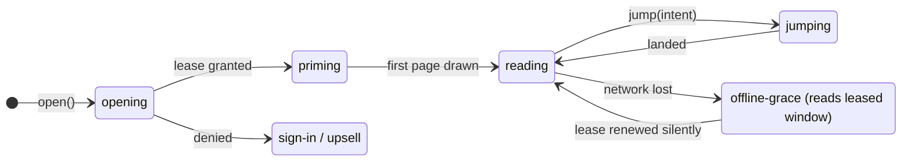

# 03 — Lumen: The Secure Reader Engine

> Lumen never knows what the book says. It knows where every glyph goes, what
> color the paper is, and how fast your finger is moving. That is enough to
> draw better pages than any DOM reader, and nothing in it is worth stealing.

---

## 1. Engine overview

### 1.1 Thread and memory topology

| Context | Runs | Holds | Never holds |
|---|---|---|---|
| **Main thread** (Reader Shell) | React chrome, settings panel, gesture capture, accessibility DOM (only when enabled) | UI state, camera *targets*, anchors | Glyph data, keys, decrypted bytes |
| **Vault Worker** | WebCrypto, WASM (Folio decoder + Compositor) | Non-extractable `CryptoKey`s, transient decrypted chunks, layout results | Unicode text (there is none to hold) |
| **Render Worker** | WebGL2 on `OffscreenCanvas`, shaders, page ring, animation physics | GPU instance buffers, atlas textures, theme uniforms | Keys, chunk payloads |
| **Service Worker** | Cache-first fetch of immutable ciphertext, offline storage | Ciphertext only | Keys |

Input crosses threads through a **`SharedArrayBuffer` ring** (pointer
samples with timestamps). This is enabled by the reader origin's COOP/COEP
isolation. A pinch never waits for `postMessage` scheduling.

*Fallback:* on browsers without WebGL2 inside `OffscreenCanvas` (older than
Safari 17), the Render Worker's logic runs on the main thread against a
regular `<canvas>`. The security properties are the same; only the input
isolation is lost.

### 1.2 Reader lifecycle (XState)



Every state is explicit. There is no UI that shows "content" while
authorization is unresolved, and no dead-end spinner. A denied `open` lands
on a designed screen: *sign in to keep reading*, or, in Phase 2, *buy or
subscribe*. It is never an error dialog.

### 1.3 Engine API (shell ↔ Lumen)

```ts
export interface Lumen {
  open(edition: EditionId, o: { at?: Anchor; viewport: Viewport }): Promise<OpenResult>;
  setTypesetting(t: Partial<Typesetting>): void;          // reflow, anchored to the first visible cluster
  setTheme(t: ThemeId | ThemeUniforms, o?: { transitionMs?: number }): void;
  setCamera(c: Partial<CameraTarget>): void;              // zoom/pan targets; physics lives in the worker
  next(): void;  prev(): void;
  goTo(target: Anchor | { fraction: number }, intent: NavIntent): Promise<void>;
  search(q: string, scope: "edition" | "library"): AsyncIterable<SearchHit>;
  readonly selection: Observable<SelectionState>;         // anchors + screen rects, never text
  annotate(r: AnchorRange, kind: "highlight" | "note", meta?: AnnotationMeta): Promise<Annotation>;
  quote(r: AnchorRange, mode: "card" | "copy"): Promise<QuoteResult>;
  on<E extends LumenEvent>(e: E, cb: (ev: LumenEventMap[E]) => void): () => void;
}

export type Anchor = readonly [chunk: number, block: number, cluster: number];
export type NavIntent = "toc" | "search" | "bookmark" | "annotation" | "progress-bar" | "resume";
```

---

## 2. Data that reaches the client

| Asset | Content | Protection |
|---|---|---|
| Manifest | Structure, TOC (as glyph runs), font metrics, style table | Public, signed |
| Flow / page chunks | Permuted glyph IDs, advances, offsets, flags, bidi levels | AES-256-GCM, per-chunk key, A/B variant |
| Atlas pages | MSDF fragments of shredded glyphs, in slots that don't match glyph IDs | AES-256-GCM, per-page key |
| Image tiles | WebP/AVIF tile pyramids, 256 px | AES-256-GCM, per-image key |
| Font files | **Never shipped** | — (this also eliminates font-licensing exposure) |
| Unicode text | **Never shipped** (except the metered channels in §8) | — |

---

## 3. The Compositor: layout without text

The Compositor is a Rust crate compiled to WASM. Its input is shaped glyph
runs with per-glyph flags (see [01 §4.4](01-architecture.md#44-payload-schemas-flatbuffers)).
Its output is positioned glyph instances per page. It never needs a Unicode
code point.

### 3.1 Typesetting state

```ts
interface Typesetting {
  font: "literata" | "source-serif" | "atkinson" | "naskh" | "original";
  size: number;            // CSS px, discrete steps (see 04 §3.3)
  leading: number;         // line-height multiplier, 1.3–1.9
  measure: number;         // max characters per line target (Latin 66, Arabic 58)
  margins: "narrow" | "normal" | "wide";
  justify: boolean;        // Knuth–Plass when true; ragged with optimal breaks when false
  hyphenate: boolean;      // ignored for scripts that don't hyphenate (e.g. Arabic)
  columns: 1 | 2 | "auto"; // "auto": two-page spread on landscape ≥ 1024 px
  progression: "ltr" | "rtl"; // from the manifest; mirrors page order and gestures
  flow: "paged" | "scrolled";
}
```

Changing `size`, `leading`, `margins`, `justify` or `columns` reflows
**locally in under one frame per visible page**. Advances scale linearly with
size, so no server call is needed. Changing `font` needs re-shaped runs
(different glyph IDs and advances), which come from the CDN as a
pre-generated font variant of the edition. It is one cached fetch, hidden
behind a 200 ms crossfade.

### 3.2 Algorithms

| Problem | Approach | Why it beats DOM readers |
|---|---|---|
| Line breaking | **Knuth–Plass** total-fit over each paragraph. Glue from `GLUE` flags, penalties from `HYPHEN_POINT`. Looseness tuned per measure. | Browsers break lines greedily. Justified text in DOM readers gets "rivers" and gappy lines; ours doesn't. |
| Arabic justification | **Kashida elongation** at `KASHIDA_OK` points (priority order from the shaping stage), then inter-word glue. Never letter-spacing. | Matches traditional Arabic typesetting. CSS `text-justify: kashida` is unsupported in practice. |
| Bidi | Paragraph levels from the server (UAX #9 rules up to L1). The Compositor applies **rule L2 per line** after breaking. | Mixed Arabic/Latin lines with numbers render correctly at every width |
| Optical margin alignment | Per-glyph protrusion table (permuted gid → protrusion %, from the manifest) lets punctuation and hyphens hang into the margin | The edge looks straight to the eye, as in print |
| Widows and orphans | Two-line minimum at top and bottom of the page. Headings are kept with their next 2 lines. | Pages that look typeset, not just filled |
| Figures | Float to the next page top if they don't fit. Captions are kept with their figure. | No orphaned captions |
| Pagination stability | Page boundaries depend only on (chunk, typesetting state). Results are memoized. | Turning back is instant, and page numbers are stable for the session |

### 3.3 Anchors: one coordinate system for everything

An **anchor** is `(chunk, block, cluster)`. It is independent of font, size,
viewport or device. Reading position, highlights, notes, bookmarks, search
hits and quotes are all anchors. Page numbers are *derived* views. That is
why "continue on laptop" lands on the exact sentence even when the laptop
shows two columns at a different font size.

**Reflow anchoring:** before any typesetting change, the Compositor records
the first fully visible cluster. After reflow, it pages to the page that
contains it. The reader never loses their place, the classic failure of
reflowable readers.

---

## 4. Anti-tamper rendering pipeline

### 4.1 Glyph permutation

At ingest, each font's glyph IDs are remapped through a random per-edition
permutation π. Chunks carry `π(gid)`, the atlas is indexed by `π(gid)`, and
the true font, its `cmap` and the Unicode mapping never leave the server. A
scraper that decrypts a chunk gets numbers that mean nothing without a
codebook, and the codebook differs per edition.

### 4.2 Glyph shredding

Permutation alone falls to a simple attack: render each atlas entry once,
OCR the few hundred images, and you have the codebook. **Shredding** closes
that shortcut:

```text
   glyph "a" outline                     atlas (MSDF slots, scattered)
   ┌───────────┐                          ┌───┬───┬───┬───┬───┬───┐
   │   ▄▀▀▀▄   │    cut along             │ ▀ │   │ ▄ │ ▌ │   │ ▀▄│
   │      ▄█   │    seeded curves         ├───┼───┼───┼───┼───┼───┤
   │   ▄▀▀ █   │   ─────────────▶ 3 frags │   │ █ │   │ ▀ │ ▄▀│   │
   │   ▀▄▄▀█   │                          └───┴───┴───┴───┴───┴───┘
   └───────────┘     slot ids: 7, 23, 41  (no slot looks like a letter;
                                           fragments are shared across glyphs)
```

- Each glyph is split into **2–3 fragments** along seeded cut curves. The
  fragments overlap by about 1 unit so they reassemble seamlessly.
- Identical fragments (the bowl shared by "b", "d", "p", "q", common Arabic
  teeth and dots) are **deduplicated across glyphs**. An atlas slot is then
  a component, not a character.
- The glyph-to-fragments composition table travels *inside the encrypted
  chunk*, not with the atlas, and is read only inside WASM memory. Rebuilding
  the codebook means decrypting chunks, extracting the composition tables,
  reassembling and rendering every composite, then OCRing it. That is
  bespoke reverse-engineering, repeated per edition because permutations and
  cut patterns differ, instead of OCRing one sprite sheet. Generic tools get
  nothing. A skilled T2 attacker spends hours to days per edition, and the
  result still carries the A/B variant watermark.
- Cost to us: 2–3× quad count, still trivial for any GPU (a dense page is
  about 3,000 glyphs, so ≈ 9,000 instanced quads).

### 4.3 Glyph rasterization: MSDF in motion, hinted at rest

| Mode | When | Technique |
|---|---|---|
| **Motion** | Pinch, pan, page transitions, theme crossfades | **Multi-channel signed distance fields** (MSDF). Resolution-independent, crisp at 800% zoom, sharp corners preserved. |
| **Rest** | Idle for 150 ms at DPR < 1.5 | Swap to a **hinted raster atlas** pre-rendered server-side at the exact pixel size (FreeType hinting, gamma-tuned), with a 1-frame crossfade. Same metrics, so nothing moves. |

On high-DPR phones and tablets, the mobile majority, MSDF is already
indistinguishable from native text and the rest swap never triggers. On
1× desktop monitors, the rest atlas recovers the hinting sharpness that SDF
rendering gives up at 14–16 px.

### 4.4 Render passes

```text
 ┌────────────────────────┐
 │ PASS 1 · COVERAGE      │
 │ instanced fragment     │
 │ quads → RGBA8 target   │       ┌───────────────────────────┐
 │ blendEquation(MAX)     │──┐    │ PASS 3 · COMPOSITE        │
 │ R=ink G=ink2 B=accent  │  │    │ full-screen triangle      │
 │ A=highlight index      │  │    │ paper + images + ink      │
 └────────────────────────┘  ├───▶│ roles + highlights →      │───▶ present
 ┌────────────────────────┐  │    │ theme, warmth, dimming,   │
 │ PASS 2 · IMAGES        │  │    │ luminance ceiling → sRGB  │
 │ tile pyramid, LOD by   │  │    └───────────────────────────┘
 │ zoom·DPR, per-image    │──┘
 │ dark-mode treatment    │
 │ (§7.5)                 │
 └────────────────────────┘
```

- **`MAX` blending in pass 1** makes overlapping fragments union cleanly, with
  no double-darkened seams. That is what makes shredding invisible.
- Ink **roles**, not colors, are rendered. The theme is applied once, in
  pass 3. Switching themes is a uniform change: no re-layout, no re-fetch, and
  a crossfade is free.
- **Render on demand.** When nothing moves, no frames are drawn and battery
  use is zero. Animation frames run only during gestures and transitions.

### 4.5 Shaders

**Pass 1 — coverage (MSDF fragment):**

```glsl
#version 300 es
precision highp float;

in vec2  v_uv;
flat in int v_role;            // 0 = ink, 1 = ink2, 2 = accent
uniform sampler2D u_atlas;
uniform float u_pxRange;       // distance range used when generating the atlas
uniform float u_weight;        // stroke-weight offset: theme compensation (§7.4)
out vec4 o_cov;

float median(vec3 v) { return max(min(v.r, v.g), min(max(v.r, v.g), v.b)); }

void main() {
  vec2 unitRange     = vec2(u_pxRange) / vec2(textureSize(u_atlas, 0));
  vec2 screenTexSize = vec2(1.0) / fwidth(v_uv);
  float screenPxRange = max(0.5 * dot(unitRange, screenTexSize), 1.0);

  float sd  = median(texture(u_atlas, v_uv).rgb) - 0.5 + u_weight;
  float cov = clamp(sd * screenPxRange + 0.5, 0.0, 1.0);

  o_cov = vec4(0.0);
  o_cov[v_role] = cov;         // MAX-blended into the role channel
}
```

**Pass 3 — composite (abridged):**

```glsl
#version 300 es
precision highp float;

in vec2 v_uv;
uniform sampler2D u_cov;       // pass 1
uniform sampler2D u_img;       // pass 2, premultiplied, linear
uniform vec3  u_paper, u_ink, u_ink2, u_accent;   // linear RGB from theme tokens
uniform vec3  u_hl[4];                            // highlight underlays
uniform float u_covGamma;      // per-theme coverage curve (dark-on-light < 1 < light-on-dark)
uniform vec3  u_warmGain;      // white-balance gains for the warmth setting
uniform float u_lumaCeil;      // anti-glare luminance ceiling (linear Y)
uniform float u_dim;           // in-app dimming below the OS brightness floor
out vec4 o;

vec3 toSrgb(vec3 c) {
  return mix(c * 12.92, 1.055 * pow(c, vec3(1.0 / 2.4)) - 0.055, step(0.0031308, c));
}

void main() {
  vec4 cov = pow(texture(u_cov, v_uv), vec4(vec3(u_covGamma), 1.0));
  vec4 img = texture(u_img, v_uv);

  vec3 c = u_paper * (1.0 - img.a) + img.rgb;                 // paper + images
  int h = int(cov.a * 4.0 + 0.5);                              // highlight index 0..4
  if (h > 0) c = u_hl[h - 1];                                  // underlay beneath ink
  c = mix(c, u_ink,    cov.r);
  c = mix(c, u_ink2,   cov.g);
  c = mix(c, u_accent, cov.b);

  c *= u_warmGain;                                             // warmth
  float Y = dot(c, vec3(0.2126, 0.7152, 0.0722));
  c *= min(1.0, u_lumaCeil / max(Y, 1e-4));                    // glare ceiling
  c *= 1.0 - u_dim;                                            // extra-dim
  o = vec4(toSrgb(c), 1.0);
}
```

### 4.6 Fixed-layout (PDF-origin) rendering

Atelier separates every PDF page into a **text layer**, re-encoded as
permuted, shredded glyph instances at absolute positions, and an **art
layer**: vector graphics and images rasterized into a 256 px tile pyramid
**with text removed**. Text therefore stays vector-crisp at 800% zoom while
art follows level-of-detail tiles: `lod = ceil(log2(zoom × DPR))`. Equations
and diagrams with embedded text can stay in the art layer when the publisher
prefers fidelity. Those pages are then protected by tiles and watermark only.

### 4.7 What an attacker actually sees

| Vantage point | Observation |
|---|---|
| DOM inspector | A `<canvas>` and the React chrome. No text nodes, no `aria-label` content (outside §8.4). |
| Network tab | Opaque binary blobs named like `c/9f2e…`, plus JSON leases with wrapped keys |
| JS heap snapshot | No strings of book text. FlatBuffers live in WASM linear memory and are wiped after layout. |
| WebGL capture (Spector.js) | Instance buffers of slot indices and atlas textures full of meaningless fragments |
| Canvas `toDataURL` | `preserveDrawingBuffer: false` means reads outside the frame return blank. Inside a frame, it gets one page image, which is the analog hole, and that image carries the watermark. |

### 4.8 Robustness

- **`webglcontextlost`** (common on mobile after backgrounding): rebuild GPU
  state from cached ciphertext, with no network and no visible flash. The
  last frame stays on screen as a static bitmap until the rebuild finishes.
- **No WebGL2** (rare): a Canvas2D backend draws the same instance lists from
  the hinted raster atlas. Effects are reduced; P1 still holds.

---

## 5. Fluid reading controls

### 5.1 Camera model

A single `mat3` camera (scale, translation) per spread, eased in the Render
Worker. Zoom and pan are **uniform updates**. Glyphs are never re-rasterized
while moving (MSDF), so a 120 Hz pinch costs one draw call per pass.

### 5.2 Gesture physics

| Gesture | Behavior | Parameters |
|---|---|---|
| Pinch | The focal point stays under the fingers (zoom about the centroid). Two-finger pan works concurrently. | Scale from the distance ratio, no smoothing lag |
| Pan release | Inertial glide, velocity from a least-squares fit of the last 80 ms of samples | Exponential decay, `0.998 / ms` |
| Edge overscroll | Rubber band | `d·(1 − 1/(x·0.55/d + 1))` |
| Snap | Critically damped spring | `k = 300`, `c = 2√k` |
| Page swipe | Commit if distance > 18% of width **or** velocity > 0.3 px/ms; otherwise spring back | Mirrored for RTL progression |
| Double tap (fixed) | Smart zoom to the tapped column or panel (block rect + 16 px padding) | 280 ms spring |
| Double tap (reflow) | Select the word (via `WORD_START` flags) | — |
| Long press | Selection with handles, then a contextual menu | 350 ms |

### 5.3 Zoom semantics

- **Reflowable books — "pinch to resize text."** While pinching, the page
  magnifies visually through the camera, crisp thanks to MSDF. On release,
  the scale snaps to the nearest type-size step and the Compositor reflows,
  anchored to the first visible cluster, behind a 160 ms crossfade. The reader
  feels direct manipulation and lands on perfectly re-typeset text, not on
  a blurry magnified page.
- **Fixed layout — true zoom (50%–800%).** Tiles stream by level of detail.
  Text stays vector-sharp. **Guided mode** handles the zoomed state: tapping
  the forward zone pans to the next block in reading order, column by column
  or comic panel by panel. Block order comes from Atelier's layout analysis
  or from publisher-supplied panel data. For RTL progression, the order mirrors.
- **Keyboard and trackpad:** `Ctrl/⌘ +/−/0` map to the same semantics. Browser
  zoom is intercepted inside the reader so the UI chrome and the page scale
  coherently.

### 5.4 Page transitions

| Transition | Implementation | Default on |
|---|---|---|
| **Slide** | Spread textures translate with gesture-driven parallax (the outgoing page moves at 0.92× speed) | All devices |
| **Curl** | Vertex shader on a 64×64 grid. Each vertex is projected onto a cylinder of radius *r* around a moving axis that follows the finger. The back face shows the next page through 6% translucency, with a soft ambient-occlusion shadow. | Tier A devices, opt-in |
| **Fade** | 120 ms crossfade | When `prefers-reduced-motion: reduce` is set |
| **Scroll** | Continuous vertical flow. Pages are virtual: the Compositor emits a seamless strip. | "Scrolled" layout |

Tap zones: the outer 30% on each side turns pages; the center 40% toggles
chrome. All zones mirror under RTL progression. Optionally, *tap anywhere to
advance* supports one-handed reading.

### 5.5 Input-to-photon path

```text
pointer event (main) ─▶ SAB ring write (≈ 0.05 ms) ─▶ render worker reads on its rAF
  ─▶ physics step ─▶ camera uniform ─▶ 3 passes (≈ 1.5–4 ms GPU on mid-range)
  ─▶ present on next vsync
target: page-turn input → first moved frame ≤ 1 vsync; ≤ 50 ms p95 end-to-end
```

---

## 6. Protected search

### 6.1 Why "encrypted client-side indexes" are theatre

A client-side search index must answer *"does term X occur at position P?"*
on the client. Whoever controls the client can ask that question for every
word in a dictionary and rebuild the text in order. Encrypting the index only
changes who holds the key, and the key has to be on the client for search to
work. Hiding it in a Web Worker or WASM raises effort slightly, but it is not
a boundary. **So full-text search is server-authoritative (D4).**

### 6.2 Oracle: online search

```jsonc
// POST /oracle/v1/search        DPoP + RCT
{ "q": "الصبر", "scope": "edition", "mode": "smart", "page": 0 }

// 200
{
  "total": 37, "shown": 20, "budget_left": 54,
  "hits": [
    {
      "start": [42, 3, 118], "end": [42, 3, 123],        // anchors
      "chapter": 4, "fraction": 0.31,
      "snippet": {                                       // a glyph run, NOT text
        "font": "f0", "gids": [ /* permuted */ ], "adv": [ ], "bidi": [ ],
        "match": [12, 17]                                // glyph-index range to emphasize
      }
    }
  ]
}
```

- **Snippets are glyph runs** in the same permuted, shredded space as the
  book. Lumen renders them in the results list through the same pipeline, so
  the search UI matches the page typography exactly. That's a UX win too.
- **Tapping a hit** issues `leases:jump` with `intent: "search"`. The
  Compositor computes highlight geometry from the hit's anchors, and the
  match pulses once (a 600 ms accent glow) and then settles into a subtle
  underline.
- **Language-aware matching:**
  - *Arabic:* strip tashkeel (U+064B–U+0652) and tatweel (U+0640). Normalize
    أ/إ/آ/ٱ → ا, ى → ي, ة → ه (configurable). Light stemming with optional
    root expansion, so searching *صبر* finds *الصابرين*. An **exact** toggle
    disables expansion.
  - *Latin and others:* NFKD + diacritic folding, case folding, Snowball
    stemming per language, phrase queries in quotes, typo tolerance
    (Levenshtein 1 for terms of 5+ characters).
- **Library scope:** "Where did I read about…?" searches every book in the
  reader's library and returns book-level groups of hits. This is a feature
  no file-based e-book can offer, and a reason to read on Sanad rather than a
  pirated PDF.

### 6.3 Anti-enumeration

Search is an oracle, and oracles can be abused to rebuild text one query at
a time. Mitigations, all invisible at human use:

| Control | Setting (Standard profile) |
|---|---|
| Query budget | Token bucket: burst 30, refill 6/min. A human researching heavily uses about 1 per minute. |
| Hit window | 20 hits per page, at most 5 pages per query |
| Snippet length | About 8 words of context on each side |
| Sweep detection | Sentinel scores query entropy, the vocabulary-coverage rate and inter-query timing. A dictionary walk looks nothing like curiosity. |
| Response | Gradual: smaller hit windows, then invisible attestation, then a temporary pause. Never a hard ban on the first signal. |

### 6.4 Offline search: page-level, by design

With an offline lease, the Vault Worker holds a **keyed Bloom filter per
chunk**. It contains `HMAC(K_search, normalize(term))` for every term in the
chunk, with a 1% false-positive rate. `K_search` is a non-extractable HMAC
key delivered inside the offline lease.

- **Offline queries answer "which chunks contain this word"**, and the results
  list shows chapter and page with no snippet. Opening a result shows the
  page, and the exact highlight appears once the device is back online.
- **Leakage, stated honestly:** a T2 attacker who drives the HMAC key can
  recover each chunk's *unordered vocabulary set*, with no positions, no
  counts and no order. That is enough to tell what a chunk is about and
  useless for reconstructing the prose. Publishers can disable offline search
  by policy, and the Vault profile does so by default.

---

## 7. Adaptive theming

### 7.1 Theme model

A theme is a **uniform block**, generated from the same design tokens as the
UI chrome ([04 §4](04-design-system.md#4-color-system)). The chrome and the
page therefore always match.

```ts
interface ThemeUniforms {
  paper: Rgb; ink: Rgb; ink2: Rgb; accent: Rgb; highlights: [Rgb, Rgb, Rgb, Rgb];
  covGamma: number;      // coverage curve
  weight: number;        // MSDF threshold offset (stroke weight)
  lumaCeil: number;      // anti-glare ceiling, linear Y
  warmth: number;        // 0 … 1 → white-balance gains (≈ 6500 K → 3400 K)
  dim: number;           // 0 … 0.6, extra-dim below the OS minimum brightness
  imagePolicy: "natural" | "dimmed" | "smart-invert";
}
```

### 7.2 Theme switching

- A theme change is a 240 ms uniform interpolation in linear RGB. There is no
  re-layout, no re-fetch and no flash. It is the smoothest possible
  transition, because nothing but colors changes.
- **Auto mode** follows `prefers-color-scheme`, with an optional local-time
  schedule (no geolocation): *Paper by day, Night after 21:00*. Warmth ramps
  over 20 minutes so the eye adapts without noticing the shift.

### 7.3 Anti-glare

| Mechanism | Effect |
|---|---|
| **No pure extremes** | Light paper is `#FBFAF7`, not `#FFFFFF`. Dark ink is `#1D1C1A`, not `#000000`. That gives 16.3:1 contrast without the halation of 21:1. |
| **Luminance ceiling** | In dark themes, the brightest pixel any image may reach is clamped, so a white diagram can't flash-bang a reader in a dark room |
| **Warmth** | White-balance gains reduce short-wavelength output. Applied to the paper and the images, so the whole page warms coherently. |
| **Extra-dim** | Multiplies output below the OS minimum brightness, for reading in bed. The in-app brightness slider controls it. |
| **OLED black** | A true `#000` option for OLED panels. Ink drops to `#B5B0A6` to limit black smear and halation while keeping 9.7:1. |

### 7.4 Optical weight compensation

Light text on a dark background *looks* bolder (irradiation), so the same font
seems heavier at night. Lumen compensates continuously through the MSDF
threshold: `u_weight` is about −0.03 in dark themes and +0.01 in light themes,
tuned per font. CSS can't do this, because it only has discrete weights or
variable-font axes. Night text looks like the same typeface, not its bold cousin.

### 7.5 Images in dark mode

Atelier classifies every image at ingest:

| Class | Detection | Dark-mode treatment |
|---|---|---|
| `photo` | Continuous-tone histogram | `dimmed`: brightness −12%, contrast −5%, never inverted |
| `lineart` | Bimodal histogram, near-white background | `smart-invert`: invert **lightness only in OKLab** (hue and chroma preserved), so a red arrow stays red |
| `transparent` | Alpha channel present | Composited onto paper. Dark strokes on transparency get a subtle halo only when contrast < 3:1. |
| `cover` / `art` | Publisher flag | `natural`, with the luminance ceiling applied |

### 7.6 Why theming cannot weaken protection

Protection lives in layout data and keys. Themes live only in pass-3
uniforms. No theme setting changes what data is fetched, decrypted or held.
The one exception is **Vault mode**, whose frames are protected video that
shaders cannot sample. There, themes are pre-rendered renditions (Paper and
Night) chosen through the manifest, so Vault titles still get a proper
dark mode (see [05 §2.4](05-security-and-drm.md#24-vault-ux-constraints-and-how-we-hide-them)).

---

## 8. Selection, annotations, quoting & accessibility

### 8.1 Selection in glyph space

Hit-testing maps a screen point to a cluster through the Compositor's line
boxes. Selection handles, word snapping (`WORD_START`), sentence snapping
(`SENTENCE_START`) and bidi-aware visual ranges are all computed in glyph
space. The selection *looks and feels* native: magnifier loupe, handles,
haptic tick on word boundaries on Android and iOS shells. It contains anchors,
never text.

The browser's own context menu is replaced on the canvas by Sanad's:
**Highlight · Note · Quote card · Copy (n left) · Search**. That is more useful
than "Save image as…", which is exactly the item it removes.

### 8.2 Highlights and notes

Four highlight colors as underlays beneath the ink, so contrast is preserved
(≥ 9.9:1 in light themes, ≥ 6.7:1 in dark). Notes appear as a margin glyph
and open in a sheet. Everything is stored as anchor ranges, syncs through the
Product API and survives reflow, device changes and edition updates (anchor
remap, [01 §5](01-architecture.md#5-atelier--the-ingestion--typesetting-pipeline)).

### 8.3 Quoting: turning a restriction into a growth loop

| Mode | What the reader gets | Under the hood |
|---|---|---|
| **Quote card** *(unlimited, rate-shaped)* | A designed image (1080×1350) with the quote in the book's typography, the cover-derived palette, title, author and a deep link. Ready for Instagram, WhatsApp or X. | Rendered server-side by the native Compositor and the true fonts. The text reaches the world as pixels, which is the analog hole on our terms: branded, attributed, linked. |
| **Copy text** *(metered)* | Plain text plus the citation: *"— Title, Author. Read on Sanad: https://…"* | `POST /kernel/v1/quote`. Debited from a publisher-set quota (e.g. 5–10% of the edition, in line with industry clipping limits). Logged in `quote_ledger`. |

### 8.4 Accessibility mode

Canvas text is invisible to assistive technology, so Lumen provides a
**first-class, metered accessibility channel** (D7). Under the European
Accessibility Act, e-books must be accessible and DRM must not block
accessibility features. Beyond the law, it is simply right.

**Activation.** The first focusable element in the reader is a visually
hidden button that screen readers announce: *"Turn on screen-reader mode."*
The same setting sits in Reader Settings → Accessibility, and the choice is
remembered per account. We do not try to detect assistive technology:
browsers rightly don't expose it, and guessing would be a privacy violation.

**Rendering.** When the mode is on, Lumen requests `POST /kernel/v1/a11y/text`
for the *visible* anchor range. The response is semantic text: headings,
paragraphs, lists, figure alt text, table structure. It populates an
accessible `<article>` that is positioned over the canvas and visually
transparent. Screen readers, braille displays and switch access work
natively. Page turns announce *"Page 142 of 380, Chapter 7"* through
`aria-live="polite"`.

**Metering.** A token bucket allows a burst of 10 pages and a sustained 4 pages
per minute. That is faster than text-to-speech at 3× speed, so a human never
hits it, and it is far too slow for bulk extraction.

**Residual risk, stated honestly.** A determined account can harvest a book
through this channel in a couple of hours. We accept that:

1. It yields no more than OCR of the canvas would.
2. It is **attributed**. The a11y ledger records which accounts fetched which
   ranges, a small population per edition.
3. The text carries an **inaudible typographic marker**: code-point variants
   of apostrophes, quotes and spaces that screen readers ignore. A careful
   attacker can normalize it away, but it catches the careless majority.

**Beyond screen readers:** full keyboard operation (←/→, Space, `/` to
search, `T` for TOC, `,` for settings), visible focus rings, 44×44 pt
minimum targets, and dyslexia-friendly options (Atkinson Hyperlegible, wider
spacing, no justification). *Read-aloud* with server-side neural TTS
(Phase 3) streams audio and never sends text to the client.

### 8.5 Other leak surfaces, closed politely

| Surface | Handling |
|---|---|
| Print / Save as PDF | `@media print` replaces the reader with a designed card: *"Printing isn't available for this book. Use quote cards to share passages."* |
| Drag the canvas out | `draggable=false`. Canvas pixel reads are mitigated as in §4.7. |
| Browser "Reader View" / translation | There are no text nodes to extract. `translate="no"` on the chrome where appropriate. |
| Screenshots | Not preventable on the open web. Attributed by watermark ([05 §3–4](05-security-and-drm.md#3-the-analog-hole-honest-engineering)). |

---

## 9. Performance budgets

| Metric | Budget | Device class |
|---|---|---|
| Reader shell JS | ≤ 150 KB gz | — |
| WASM (Folio + Compositor) | ≤ 400 KB gz, streamed compile | — |
| First page (warm shell) | ≤ 1.0 s at p75 | Mid-range Android, 4G |
| First page (cold) | ≤ 2.0 s at p75 | Mid-range Android, 4G |
| Page turn, input → first moved frame | ≤ 1 vsync | All |
| Page turn, end-to-end | ≤ 50 ms at p95 | All |
| Pinch-zoom frame time | ≤ 16.7 ms at p95 (≤ 8.3 ms on 120 Hz) | Tiers A/B |
| Reflow on font-size change (visible spread) | ≤ 16 ms | Tier B |
| Theme switch | 240 ms animation, 0 dropped frames | All |
| Memory | ≤ 250 MB | Mobile |
| Idle GPU/CPU | 0 frames, 0% | All |

**Device tiers** are detected at startup with a 2-frame GPU micro-benchmark
plus `navigator.hardwareConcurrency` and `deviceMemory`, and the result is cached:

- **Tier A:** curl transitions, 120 Hz, two-page spreads with live shadows.
- **Tier B:** slide transitions, 60 Hz, all typography features.
- **Tier C:** fade transitions, the Canvas2D fallback when needed, lower
  page-ring depth. *Typography quality is never tiered down.*
